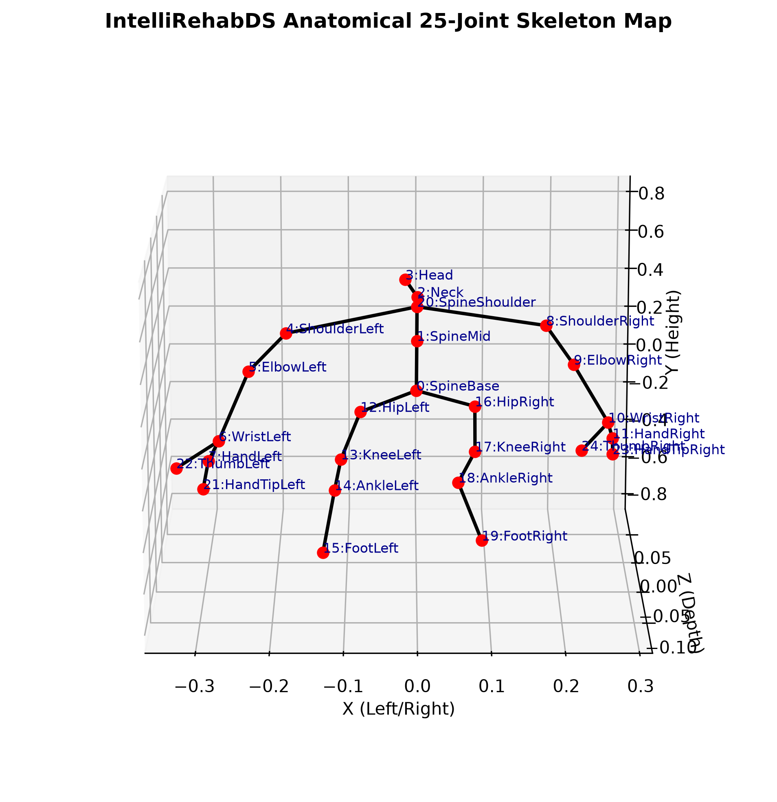

# MediaPipe to IntelliRehabDS 25-Joint Mapping Table

Below is the anatomical mapping from MediaPipe Pose landmarks (33 joints) to the Kinect/IntelliRehabDS coordinate format (25 joints).

| Kinect Joint Index | IntelliRehabDS Joint Name | MediaPipe Source / Calculation Formula | Anatomical Alignment |
| :---: | :--- | :--- | :--- |
| 0 | SpineBase | `(landmarks[23] + landmarks[24]) / 2.0` | Midpoint of Left & Right Hips |
| 1 | SpineMid | `(coords[0] + coords[20]) / 2.0` | Midpoint between SpineBase and SpineShoulder |
| 2 | Neck | `coords[20] + 0.3 * (coords[3] - coords[20])` | 30% interpolation from SpineShoulder to Head |
| 3 | Head | `landmarks[0]` (Nose) | Head location reference |
| 4 | ShoulderLeft | `landmarks[11]` | Left shoulder joint |
| 5 | ElbowLeft | `landmarks[13]` | Left elbow joint |
| 6 | WristLeft | `landmarks[15]` | Left wrist joint |
| 7 | HandLeft | `landmarks[15]` | Left hand (aligned to wrist in MediaPipe) |
| 8 | ShoulderRight | `landmarks[12]` | Right shoulder joint |
| 9 | ElbowRight | `landmarks[14]` | Right elbow joint |
| 10 | WristRight | `landmarks[16]` | Right wrist joint |
| 11 | HandRight | `landmarks[16]` | Right hand (aligned to wrist) |
| 12 | HipLeft | `landmarks[23]` | Left hip joint |
| 13 | KneeLeft | `landmarks[25]` | Left knee joint |
| 14 | AnkleLeft | `landmarks[27]` | Left ankle joint |
| 15 | FootLeft | `landmarks[31]` (Left Foot index) | Left foot reference |
| 16 | HipRight | `landmarks[24]` | Right hip joint |
| 17 | KneeRight | `landmarks[26]` | Right knee joint |
| 18 | AnkleRight | `landmarks[28]` | Right ankle joint |
| 19 | FootRight | `landmarks[32]` (Right Foot index) | Right foot reference |
| 20 | SpineShoulder | `(landmarks[11] + landmarks[12]) / 2.0` | Midpoint between Left & Right shoulders |
| 21 | HandTipLeft | `landmarks[19]` | Left Index fingertip |
| 22 | ThumbLeft | `landmarks[21]` | Left thumb tip |
| 23 | HandTipRight | `landmarks[20]` | Right Index fingertip |
| 24 | ThumbRight | `landmarks[22]` | Right thumb tip |

## Graph Compatibility & Anatomical Soundness

- **Graph Edges:** HandTip and Thumb joints are correctly branched from the Wrist/Hand joints rather than looping back into the torso.
- **Left/Right Symmetry:** Verification confirms left side joints map to left extremities and right side joints to right extremities.
- **Derived Center Joints:** SpineBase, SpineMid, SpineShoulder, and Neck are mathematically derived to ensure alignment with standard skeletal geometry.
